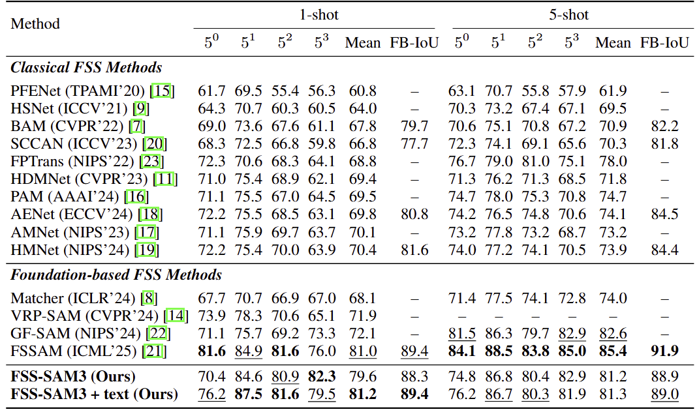
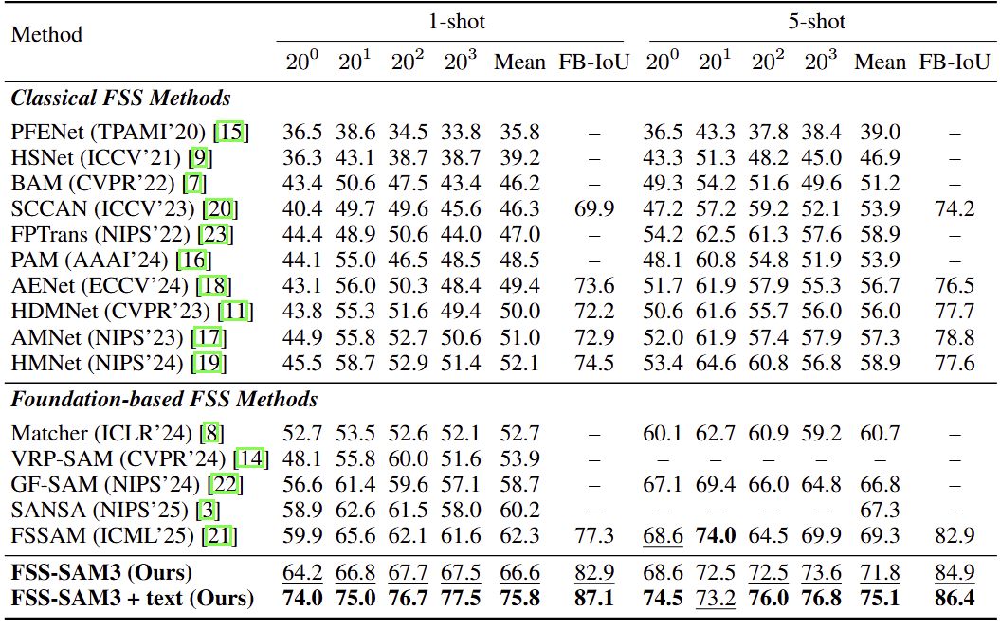

# [Few Shot Semantic Segmentation Meets SAM3](https://arxiv.org/abs/2604.05433)

This repository contains the evaluation code for applying the SAM3 (Segment Anything Model 3) to Few-Shot Segmentation (FSS) tasks. We explore the model's few-shot capabilities with a unified canvas using geometric prompts (bounding boxes) and analyze its performance on standard datasets like COCO-20i and PASCAL-5i.

Furthermore, this project investigates a novel two-stage inference approach using Negative Prompt Mining to refine segmentation results and reduce false positives.


## 📂 Repository Structure

The evaluation framework is divided into two main scripts:

* `evaluate.py`: The unified baseline evaluation script for 1-shot and 5-shot FSS tasks. It supports multiple canvas layouts, text prompt toggling, and target/support swapping.
* `evaluate_neg.py`: An experimental ablation script focusing on 1-shot COCO. It introduces a two-stage inference pipeline that automatically extracts negative bounding boxes from the support image based on model confidence scores.


## 🚀 Quick Start

### 1. Standard Evaluation

The script `./model/evaluate.py` handles the standard pairwise evaluation. By default, it runs COCO 1-shot evaluation with text prompt enabled.

**Basic Usage:**
```bash
# Run COCO 1-shot
python evaluate.py

# Run PASCAL 1-shot
python evaluate.py --dataset pascal

# Run COCO 5-shot
python evaluate.py --shot 5

# Run PASCAL 5-shot
python evaluate.py --dataset pascal --shot 5
```

**Advanced Configurations:**
```bash
# COCO 1-shot with visual prompt only
python evaluate.py --disable_text

# PASCAL 1-shot with Horizontal orientation and custom canvas ratio
python evaluate.py --dataset pascal --orient horizontal --ratio 0.5

# COCO 5-shot with Vertical Strip layout
python evaluate.py --shot 5 --layout vertical_strip
```

### 2. Negative Mining Evaluation

The script `./model/evaluate_neg.py` runs the customized two-stage pipeline. It first infers the support image to extract positive (score > 0.5) and negative (0.1 < score <= 0.5) geometric prompts, then projects these multiple prompts onto the collage canvas for precise target segmentation.

**Usage:**
```bash
# Run 1-shot COCO with Negative Mining
python evaluate_neg.py --max_neg 1
```
*(Note: The canvas layout is fixed to Support at the Bottom with a 0.6 ratio for this specific experiment.)*


## 📊 Evaluation Metrics

Both scripts automatically compute and output the following metrics across 4 cross-validation folds:
* **mIoU (Mean Intersection over Union):** The standard class-wise segmentation accuracy.
* **FB-IoU (Foreground-Background IoU):** The average IoU of the foreground and background regions.

#### Comparison with state-of-the-art methods on PASCAL-5i dataset

<p>
  
</p>

#### Comparison with state-of-the-art methods on COCO-20i dataset
<p>
  
</p>

#### Experiment on the number of negative prompts for COCO-20i dataset
$\Delta_m$ and $\Delta_F$ represent the decrease in mIoU and FB-IoU, respectively, compared to the $N_{neg}=0$ baseline.

| Max Negative Prompts | $20^0$ | $20^1$ | $20^2$ | $20^3$ | mIoU | $\Delta_m$ | FB-IoU | $\Delta_F$ |
| :--- | :---: | :---: | :---: | :---: | :---: | :---: | :---: | :---: |
| $N_{neg} = 0$ (Positive Only) | 64.2 | 66.8 | 67.7 | 67.5 | 66.6 | -- | 82.9 | -- |
| $N_{neg} \le 1$ | 51.1 | 57.5 | 54.2 | 56.6 | 54.8 | -11.8 | 77.2 | -5.7 |
| $N_{neg} \le 3$ | 41.7 | 49.1 | 47.6 | 47.9 | 46.6 | -20.0 | 73.1 | -9.8 |
| $N_{neg} \le 5$ | 40.0 | 48.1 | 45.9 | 44.9 | 44.7 | -21.9 | 72.4 | -10.5 |


## 🖼️ Visualizations

To help qualitatively analyze the model's behavior, the scripts automatically save visualization collages for the first few episodes of each fold.
* Outputs are saved in: `vis_results/<dataset>_<shot>shot/` or `vis_results/coco_neg_<max_neg>`.
* The visualizations include the prompt boxes (Green for Positive, Red for Negative) and the local IoU score stamped on the target image.


## 📥 Download Datasets

Our dataset setup and directory structure follow the convention used in [VRPSAM](https://github.com/syp2ysy/VRP-SAM).

### 1. Download Datasets

> #### 1. PASCAL-5i
> Download PASCAL VOC2012 devkit (train/val data):
> ```bash
> wget http://host.robots.ox.ac.uk/pascal/VOC/voc2012/VOCtrainval_11-May-2012.tar
> ```
> Download PASCAL VOC2012 SDS extended mask annotations from the [[Google Drive](https://drive.google.com/file/d/10zxG2VExoEZUeyQl_uXga2OWHjGeZaf2/view?usp=sharing)].

> #### 2. COCO-20i
> Download COCO2014 train/val images and annotations: 
> ```bash
> wget http://images.cocodataset.org/zips/train2014.zip
> wget http://images.cocodataset.org/zips/val2014.zip
> wget http://images.cocodataset.org/annotations/annotations_trainval2014.zip
> ```
> Download COCO2014 train/val annotations from the Google Drive: [[train2014.zip](https://drive.google.com/file/d/1cwup51kcr4m7v9jO14ArpxKMA4O3-Uge/view?usp=sharing)], [[val2014.zip](https://drive.google.com/file/d/1PNw4U3T2MhzAEBWGGgceXvYU3cZ7mJL1/view?usp=sharing)].
> (and locate both train2014/ and val2014/ under annotations/ directory).

### 2. Directory Structure

The dataset directory structure should be organized as follows.

```text
./                                            # Project Root
└── data/                                     # Dataset and Dataloader directory
    ├── MSCOCO2014/           
    │   ├── annotations/      
    │   ├── train2014/        
    │   └── val2014/          
    └── VOCdevkit/
        └── VOC2012/
            ├── Annotations/
            ├── ImageSets/
            ├── JPEGImages/
            └── SegmentationClassAug/  
```

## 📄 Acknowledgement & License

- The core architecture and some utility scripts are based on **[Segment Anything Model 3 (SAM3)](https://github.com/facebookresearch/sam3)**.
- We thank the Meta AI team for their amazing work.
- This project follows the original **SAM License** found in the `LICENSE` file. Our modifications are also open-sourced under the same terms.


<br>


## [Update] Few-Shot Object Detection (FSOD)

We additionally evaluate our FSS-SAM3 under the Few-Shot Object Detection (FSOD) setting using the unified support-query collage framework with geometric prompts.

Our evaluation protocol follows the dataset setup from [FSOD-VFM](https://github.com/Intellindust-AI-Lab/FSOD-VFM), including:
- PASCAL VOC Few-Shot Detection benchmark
- COCO Few-Shot Detection benchmark

### FSOD Evaluation

```bash
# Pascal 1-shot
python model/fsod_eval.py --dataset pascal --shot 1

# Pascal 5-shot
python model/fsod_eval.py --dataset pascal --shot 5

# COCO 1-shot
python model/fsod_eval.py --dataset coco --shot 1

# COCO 5-shot
python model/fsod_eval.py --dataset coco --shot 5
```

### PASCAL Few-Shot Detection Results

#### 1-shot

| Split | AP50 | AP |
|---|---:|---:|
| split1 | 0.8271 | 0.6916 |
| split2 | 0.7847 | 0.6421 |
| split3 | 0.8393 | 0.6934 |
| **Mean** | **0.8170** | **0.6757** |

#### 5-shot

| Split | AP50 | AP |
|---|---:|---:|
| split1 | 0.8949 | 0.7476 |
| split2 | 0.8775 | 0.7057 |
| split3 | 0.8988 | 0.7271 |
| **Mean** | **0.8904** | **0.7268** |

### COCO Few-Shot Detection Results

The original FSOD-VFM COCO benchmark provides fixed support protocols for:
- 10-shot
- 30-shot

Since our canvas-based prompting framework currently supports up to five support images within a single collage layout, we evaluate the 1-shot and 5-shot settings instead of the original 10-shot and 30-shot configurations.

| Setting | AP | AP50 |
|---|---:|---:|
| COCO 1-shot | 0.3049 | 0.3818 |
| COCO 5-shot | 0.3382 | 0.4287 |

### Dataset Setup

Please follow the dataset structure and benchmark protocol from [FSOD-VFM](https://github.com/Intellindust-AI-Lab/FSOD-VFM).

The repository includes:
- Pascal VOC episodic split JSON files
- COCO fixed-support JSON files
- Unified evaluation scripts for Pascal and COCO benchmarks